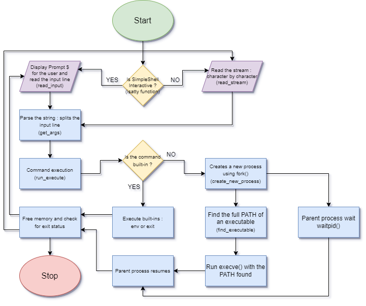

# holbertonschool-simple_shell


## Description

This project is a simple UNIX command interpreter that replicates some functionalities of the shell (sh).

This mini shell reads commands from either interactive mode and non-interactive mode.

## Files

| Name | Description |
| ------------------------------ | -------------------------------------------- |
| shell.h | Header file program. |
| main.c | Main function, interactive and non-interactive. |
| create_new_process.c | Function that creates a new process. |
| builtin_env.c | Function that prints environment variables. |
| builtin_exit.c | Exit shell with a given state. |
| read_input.c | Read a line from stdin. |
| read_stream.c | Read a line from the stream. |
| shell_interactive.c | Run shell interactive mode. |
| shell_no_interactive.c | Run shell non-interactive mode. |
| get_args.c | Split a string into tokens. |
| run_execute.c | Number of builtin functions. |
| find_executable.c | Find the full path of an executable. |

## List of functions and system calls.

* ```write``` Writes data to a file descriptor. (man 2 write)
* ```access``` Checks file accessibility. (man 2 access)
* ```fprintf``` Prints formatted output to a given stream. (man 3 fprintf)
* ```exit``` Terminates the process. (man 3 exit)
* ```fork``` Creates a child process. (man 2 fork)
* ```free``` Frees dynamically allocated memory. (man 3 free)
* ```getline``` Reads a line from a stream. (man 3 getline)
* ```isatty``` Tests whether a file descriptor refers to a terminal. (man 3 isatty)
* ```malloc``` Allocates memory dynamically. (man 3 malloc)
* ```perror``` Prints an error message to stderr. (man 3 perror)
* ```strtok``` Tokenizes strings. (man 3 strtok)
* ```waitpid``` Waits for a process to change state. (man 2 waitpid)
* ```execve``` Executes a program. (man 2 execve)

## Install

Clone this repo and compile as follow:

> gcc -Wall -Werror -Wextra -pedantic -std=gnu89 *.c -o hsh

## Usage

Interactive mode: ```./hsh```

Non-interactive mode: ```echo "/bin/ls" | ./hsh```

### Built-ins

* ```env```
* ```exit```

### Examples

* **Run shell in interactive mode:**

```
 $ ./hsh
($) ls -l
total 48
-rw-r--r-- 1 vscode vscode   165 Dec 19 08:41 AUTHORS
-rw-r--r-- 1 vscode vscode  2779 Dec 21 15:51 README.md
-rw-r--r-- 1 vscode vscode   347 Dec 19 08:41 builtin_env.c
-rw-r--r-- 1 vscode vscode   192 Dec 19 08:41 builtin_exit.c
-rw-r--r-- 1 vscode vscode   929 Dec 21 10:31 create_process.c
-rw-r--r-- 1 vscode vscode  1091 Dec 21 10:31 find_executable.c
-rw-r--r-- 1 vscode vscode   822 Dec 20 09:23 get_args.c
-rwxr-xr-x 1 vscode vscode 17888 Dec 21 17:25 hsh
drwxr-xr-x 1 vscode vscode  4096 Dec 21 10:38 image
-rw-r--r-- 1 vscode vscode   307 Dec 21 10:31 main.c
```
```
 $ ./hsh
($) echo “Hello, World!”
“Hello, World!”
```
* **Run shell in non-interactive mode:**

```
 $ echo "/bin/ls" | ./hsh
AUTHORS            hsh                 read_stream.c
builtin_env.c      image               run_execute.c
builtin_exit.c     main.c              shell.h
create_process.c   man_1_simple_shell  shell_interactive.c
```

## Authors

<h3 align="left"> Tuyen Huynh </h3>

<h3 align="left"> Gabriel Martin </h3>
